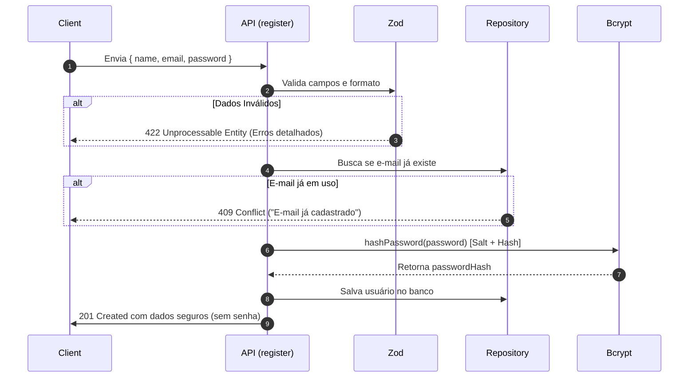
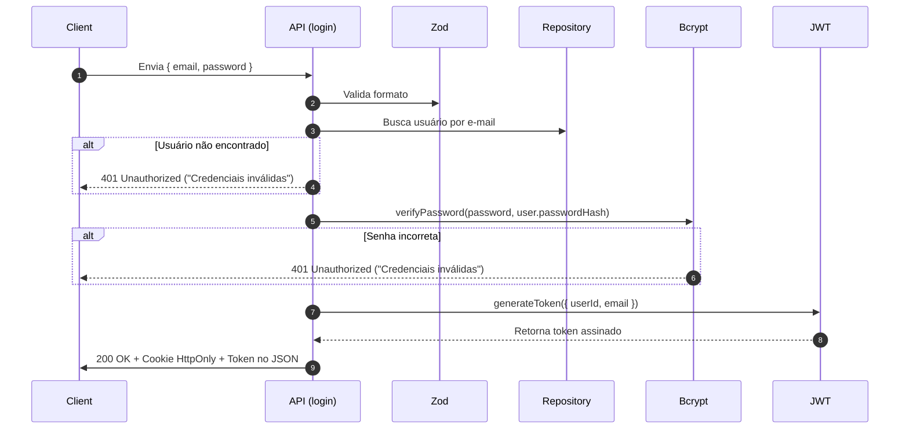
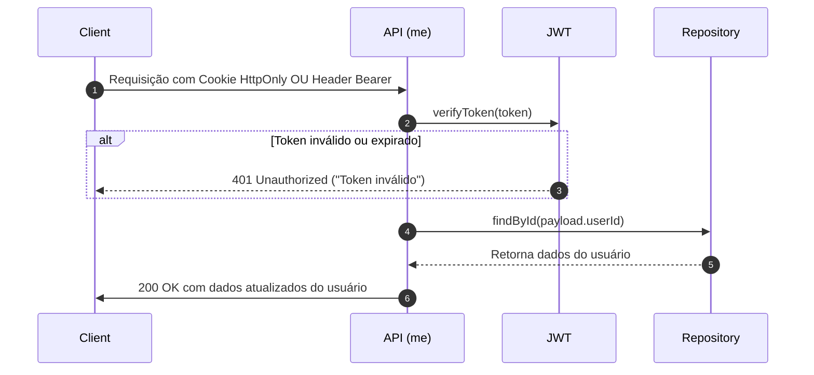
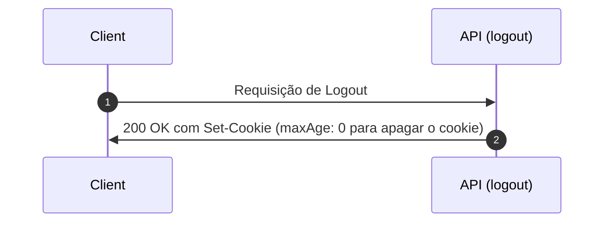

# 🛡️ Guia Completo da Arquitetura de Autenticação (Backend Next.js)

Este documento foi preparado para explicar em detalhes o funcionamento do backend de autenticação, o papel de cada biblioteca e ferramenta utilizada, os fluxos de segurança e como testar e estender a aplicação.

---

## 📚 Índice

1. [Visão Geral da Arquitetura](#-visão-geral-da-arquitetura)
2. [O que é e o que faz cada Ferramenta?](#-o-que-é-e-o-que-faz-cada-ferramenta)
   - [1. Bcrypt (`bcryptjs`)](#1-bcrypt-bcryptjs)
   - [2. JWT (`jsonwebtoken`)](#2-jwt-jsonwebtoken)
   - [3. Zod](#3-zod)
   - [4. Next.js App Router (Route Handlers)](#4-nextjs-app-router-route-handlers)
   - [5. Cookies HttpOnly & SameSite](#5-cookies-httponly--samesite)
   - [6. TypeScript](#6-typescript)
3. [Estrutura de Pastas e Arquivos](#-estrutura-de-pastas-e-arquivos)
4. [Fluxo das Requisições](#-fluxo-das-requisições)
   - [Fluxo de Registro (`POST /api/auth/register`)](#a-fluxo-de-registro-post-apiauthregister)
   - [Fluxo de Login (`POST /api/auth/login`)](#b-fluxo-de-login-post-apiauthlogin)
   - [Fluxo de Verificação / Perfil (`GET /api/auth/me`)](#c-fluxo-de-verificação--perfil-get-apiauthme)
   - [Fluxo de Logout (`POST /api/auth/logout`)](#d-fluxo-de-logout-post-apiauthlogout)
5. [Como Testar as APIs (Exemplos Práticos)](#-como-testar-as-apis-exemplos-práticos)
6. [Como Conectar um Banco de Dados Real no Futuro](#-como-conectar-um-banco-de-dados-real-no-futuro)

---

## 🏛️ Visão Geral da Arquitetura

Nossa autenticação foi construída sobre o padrão **Stateless com JWT e Cookies HttpOnly**:
- **Stateless**: O servidor não precisa manter uma sessão em memória ou banco para saber quem está logado a cada requisição. O próprio token assinado criptograficamente comprova a identidade.
- **Segurança Reforçada**: As senhas nunca são salvas em texto puro (usamos hashing com Salt via Bcrypt). Os dados recebidos são rigorosamente validados antes de qualquer ação (usando Zod).

---

## 🛠️ O que é e o que faz cada Ferramenta?

### 1. Bcrypt (`bcryptjs`)
* **O que é:** Uma biblioteca de hashing criptográfico unidirecional criada especificamente para senhas.
* **O que está fazendo no nosso projeto:**
  1. **Hashing Unidirecional:** Transforma a senha em texto puro (ex: `"Senha@123"`) em uma cadeia de caracteres criptográfica (ex: `"$2a$10$N9qo8uLOick..."`). Esse processo **não pode ser desfeito** (não existe "descriptografar" o hash do bcrypt).
  2. **Geração de Salt (Sal):** Antes de gerar o hash, o Bcrypt gera um texto aleatório chamado *Salt* e o mistura à senha. Isso faz com que dois usuários com a mesma senha tenham hashes completamente diferentes no banco, neutralizando ataques de *Rainbow Tables* (tabelas de senhas pré-calculadas).
  3. **Rounds de Custo (Salt Rounds):** Configuramos com **10 rounds** ($2^{10} = 1.024$ iterações). Isso torna o cálculo intencionalmente um pouco lento para computadores, tornando ataques de força bruta inviáveis para invasores.
  4. **Comparação Segura:** Quando o usuário tenta fazer login, o `bcrypt.compare()` extrai o salt do hash salvo, recalcula o hash com a senha digitada e compara de forma segura contra ataques de temporização (*timing attacks*).

---

### 2. JWT (`jsonwebtoken`)
* **O que é:** JSON Web Token (RFC 7519) é um padrão para transmissão compacta e segura de dados entre cliente e servidor em formato JSON assinado.
* **Estrutura de um JWT (3 partes separadas por ponto `.`):**
  - **Header:** Informa o tipo do token (`JWT`) e o algoritmo de assinatura (`HS256`).
  - **Payload:** Informações públicas codificadas em Base64 (no nosso caso: `userId`, `email`, data de criação `iat` e data de expiração `exp`).
  - **Signature (Assinatura):** É gerada pelo servidor combinando Header + Payload + Chave Secreta (`JWT_SECRET`).
* **O que está fazendo no nosso projeto:**
  1. **Geração do Token (`generateToken`):** Após validar a senha no login, geramos o token assinado com validade de 7 dias.
  2. **Validação do Token (`verifyToken`):** Nas rotas protegidas (como `/api/auth/me`), o servidor lê o token e verifica se a assinatura bate com o `JWT_SECRET`. Se alguém alterar o `userId` no payload, a assinatura quebra e o servidor rejeita imediatamente a requisição.

---

### 3. Zod
* **O que é:** Uma biblioteca TypeScript-first para definição e validação de esquemas (schemas) de dados no runtime.
* **O que está fazendo no nosso projeto:**
  1. **Sanitização e Validação:** Analisa o corpo das requisições HTTP antes de qualquer processamento:
     - Garante que o e-mail possui formato válido (`usuario@dominio.com`).
     - Garante tamanho mínimo de senha (mínimo de 6 caracteres).
     - Remove espaços em branco acidentais (`.trim()`) e converte e-mails para minúsculas (`.toLowerCase()`).
  2. **Respostas de Erro Amigáveis:** Se o cliente enviar dados inválidos ou faltantes, o Zod gera mensagens claras explicando exatamente qual campo está com problema (ex: `"O nome deve ter pelo menos 2 caracteres"`).
  3. **Segurança do Backend:** Impede que dados inesperados, nulos ou maliciosos cheguem às camadas de banco de dados e criptografia.

---

### 4. Next.js App Router (Route Handlers)
* **O que é:** O mecanismo moderno do Next.js para criar endpoints de API RESTful usando arquivos `route.ts`.
* **O que está fazendo no nosso projeto:**
  - Cada pasta dentro de `src/app/api/...` com um arquivo `route.ts` expõe métodos HTTP (`GET`, `POST`, `PUT`, `DELETE`).
  - Recebe os objetos `NextRequest` e retorna `NextResponse.json(...)` com status HTTP padronizados (200 OK, 201 Created, 400 Bad Request, 401 Unauthorized, 409 Conflict, 422 Unprocessable Entity).

---

### 5. Cookies HttpOnly & SameSite
* **O que é:** Um mecanismo de armazenamento de cookies no navegador com configurações avançadas de segurança.
* **O que está fazendo no nosso projeto:**
  - **`httpOnly: true`:** O JavaScript do navegador (ex: `document.cookie`) **NÃO** consegue ler o cookie. Isso impede que scripts maliciosos injetados por ataques de XSS (Cross-Site Scripting) roubem o token de sessão do usuário.
  - **`sameSite: 'lax'`:** Impede que sites externos enviem requisições forjadas com o cookie do usuário (proteção contra CSRF).
  - **`secure: true` (em produção):** Garante que o cookie só trafegue em conexões seguras HTTPS.

---

### 6. TypeScript
* **O que é:** Superset do JavaScript que adiciona tipagem estática e interfaces.
* **O que está fazendo no nosso projeto:**
  - Define os contratos de dados (`User`, `SafeUser`, `JWTPayload`, `AuthResponse`).
  - Garante em tempo de desenvolvimento que campos sensíveis como `passwordHash` nunca sejam vazados acidentalmente em respostas de API.

---

## 📁 Estrutura de Pastas e Arquivos

```
moradanossolar/
├── .env.local                    # Variáveis de ambiente secretas (JWT_SECRET, etc.)
├── .env.example                  # Modelo de variáveis de ambiente
├── DOCS_AUTENTICACAO.md          # Esta documentação completa
├── package.json                  # Dependências instaladas
├── tsconfig.json                 # Configuração do TypeScript
└── src/
    ├── types/
    │   └── auth.ts               # Interfaces TypeScript (User, SafeUser, JWTPayload, etc.)
    ├── lib/
    │   ├── db.ts                 # Repositório de Usuários (simulação de banco / repository pattern)
    │   ├── auth/
    │   │   ├── password.ts       # Funções de Hash e Comparação com Bcrypt
    │   │   ├── jwt.ts            # Funções de Geração e Validação do JWT
    │   │   └── session.ts        # Utilitários de Cookies HttpOnly e extração de sessão
    │   └── validations/
    │       └── auth.ts           # Schemas de validação Zod (Register e Login)
    ├── middleware.ts             # Middleware do Next.js para interceptação de rotas
    └── app/
        └── api/
            └── auth/
                ├── register/
                │   └── route.ts  # POST /api/auth/register (Cadastro de usuário)
                ├── login/
                │   └── route.ts  # POST /api/auth/login (Login e emissão de JWT)
                ├── me/
                │   └── route.ts  # GET /api/auth/me (Rota protegida / perfil do usuário)
                └── logout/
                    └── route.ts  # POST /api/auth/logout (Limpeza de sessão e cookies)
```

---

## 🔄 Fluxo das Requisições

### A. Fluxo de Registro (`POST /api/auth/register`)


---

### B. Fluxo de Login (`POST /api/auth/login`)


---

### C. Fluxo de Verificação / Perfil (`GET /api/auth/me`)


---

### D. Fluxo de Logout (`POST /api/auth/logout`)


---

## 🧪 Como Testar as APIs (Exemplos Práticos)

Você pode testar os endpoints utilizando ferramentas como **Postman**, **Insomnia**, a extensão **Thunder Client** do VS Code, ou o terminal via **cURL**.

### 1. Inicie o servidor Next.js:
```bash
npm run dev
```
O servidor estará rodando em `http://localhost:3000`.

---

### 2. Testando o Registro (`POST /api/auth/register`)

**Requisição (cURL):**
```bash
curl -X POST http://localhost:3000/api/auth/register \
  -H "Content-Type: application/json" \
  -d '{
    "name": "Maria Silva",
    "email": "maria@moradanossolar.com.br",
    "password": "SenhaSegura@2026"
  }'
```

**Resposta de Sucesso (Status 201):**
```json
{
  "success": true,
  "message": "Usuário cadastrado com sucesso!",
  "user": {
    "id": "usr_1756942000000_abc123",
    "name": "Maria Silva",
    "email": "maria@moradanossolar.com.br",
    "createdAt": "2026-09-03T23:00:00.000Z",
    "updatedAt": "2026-09-03T23:00:00.000Z"
  }
}
```

---

### 3. Testando o Login (`POST /api/auth/login`)

**Requisição (cURL):**
```bash
curl -X POST http://localhost:3000/api/auth/login \
  -H "Content-Type: application/json" \
  -d '{
    "email": "maria@moradanossolar.com.br",
    "password": "SenhaSegura@2026"
  }'
```

**Resposta de Sucesso (Status 200):**
```json
{
  "success": true,
  "message": "Login realizado com sucesso!",
  "user": {
    "id": "usr_1756942000000_abc123",
    "name": "Maria Silva",
    "email": "maria@moradanossolar.com.br"
  },
  "token": "eyJhbGciOiJIUzI1NiIsInR5cCI6IkpXVCJ9.eyJ1c2VySWQiOiJ1c3JfMS..."
}
```
*(Além do JSON, a resposta inclui o cabeçalho `Set-Cookie: morada_auth_token=...; HttpOnly; Path=/`)*.

---

### 4. Testando a Rota Protegida (`GET /api/auth/me`)

**Opção A: Usando o cabeçalho Bearer Token**
```bash
curl -X GET http://localhost:3000/api/auth/me \
  -H "Authorization: Bearer SEU_TOKEN_JWT_AQUI"
```

**Opção B: Usando Cookie no Navegador / Postman**
Basta fazer a requisição `GET http://localhost:3000/api/auth/me` (o cookie será enviado automaticamente).

**Resposta de Sucesso (Status 200):**
```json
{
  "success": true,
  "message": "Dados do usuário autenticado recuperados com sucesso.",
  "user": {
    "id": "usr_1756942000000_abc123",
    "name": "Maria Silva",
    "email": "maria@moradanossolar.com.br"
  }
}
```

---

### 5. Testando o Logout (`POST /api/auth/logout`)

```bash
curl -X POST http://localhost:3000/api/auth/logout
```

**Resposta de Sucesso (Status 200):**
```json
{
  "success": true,
  "message": "Logout realizado com sucesso. Sessão encerrada."
}
```

---

## 🗄️ Como Conectar um Banco de Dados Real no Futuro

Toda a lógica de acesso a dados foi isolada em [`src/lib/db.ts`](file:///c:/Users/cauev_zvp7t7k/OneDrive%20-%20Companhia%20Paulista%20De%20Trens%20Metropolitanos/Documentos/moradanossolar/src/lib/db.ts). 

Quando você decidir integrar um banco de dados relacional (PostgreSQL / MySQL) ou NoSQL (MongoDB), você **NÃO precisará alterar nenhuma rota da API**. Basta atualizar os métodos de `userRepository`:

```typescript
// Exemplo com Prisma ORM:
export const userRepository = {
  async findByEmail(email: string) {
    return await prisma.user.findUnique({ where: { email } });
  },
  async findById(id: string) {
    return await prisma.user.findUnique({ where: { id } });
  },
  async create(data: { name: string; email: string; passwordHash: string }) {
    return await prisma.user.create({ data });
  },
};
```
